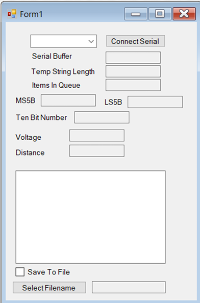
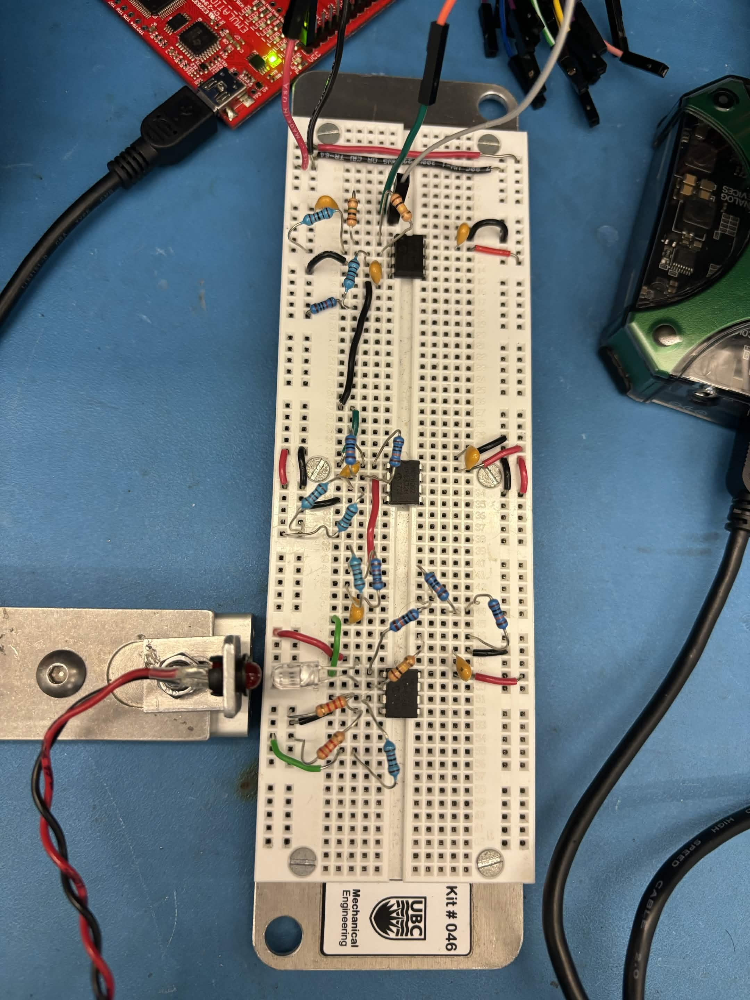

### Goal 
Design an optical distance sensor using op-amps, a photodiode and an LED. Build a C# program to acquire data and display data from the distance sensor.

### Process
The project involved creating amplifiers, high-pass filters, low-pass filters and rectifiers with specified cut-off frequencies and gains using op-amps, resistors and capacitors. The output voltage is sent to an MSP430 microcontroller, and a C# program reads the voltage and converts it to the distance the photodiode is from the LED. To find the relationship between the output voltage and the distance, points for the voltage and distance were plotted to find a relation. 

### Results

